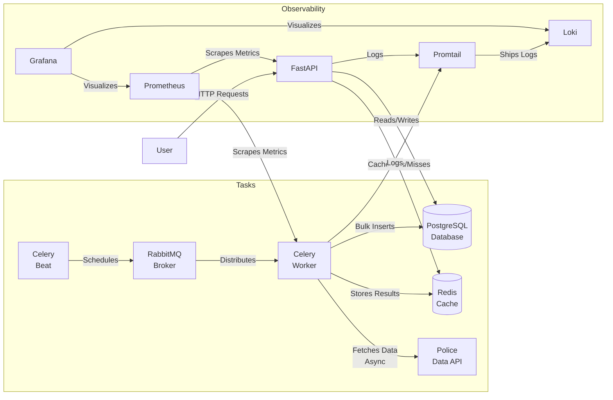

# ADSP Interview Task - Police Stop & Search Data Ingestion

This project is a containerised Python application designed to ingest, process, and store historical stop and search data from the UK Police Data API. It is built to be resilient, scalable, and observable.

## 📑 Table of Contents
- [Project Overview](#-project-overview)
- [Architecture](#-architecture)
- [Project Structure](#-project-structure)
- [Setup & Installation](#-setup--installation)
- [Available Commands](#-available-commands)
- [Design Decisions & Trade-offs](#-design-decisions--trade-offs)
- [Monitoring & Grafana](#-monitoring--grafana)
- [Productionisation & Future Steps](#-productionisation--future-steps)

---

## 📋 Project Overview

The application automatically fetches stop and search data for configured police forces (e.g., Metropolitan Police) on a daily schedule. It handles data remediation, validation, and storage in a PostgreSQL database, exposing the data via a REST API for downstream consumption.

### Key Features
- **Automated Ingestion**: Daily scheduled tasks (via Celery Beat) to fetch new data.
- **Resilient Processing**: Retries on API failures, robust error handling, and "dead letter" storage for failed rows.
- **Data Quality**: Automatic remediation of known data issues (e.g., type mismatches) and validation against a schema using **Pandera**.
- **High Performance**: 
    - **Async I/O**: Concurrent fetching of data using `httpx` and `asyncio`.
    - **Vectorized Processing**: Uses **Pandas** for efficient in-memory data manipulation and cleaning.
    - **Bulk Inserts**: Uses PostgreSQL `COPY` for efficient bulk insertion of large datasets.
    - **Celery task splitting**: Distributes force queries across multiple concurrent Celery tasks using chords and groups.
    - **Non-blocking**: Web server remains responsive even during heavy ingestion loads.
    - **Discriminatory Queries**: Fetches only available, previously un-ingested dates to avoid duplicate data retrieval.
- **Observability**: Full monitoring stack with Prometheus, Grafana, and Loki.
- **Containerised**: Fully Dockerised environment for consistent deployment.

---

## 🏗 Architecture

The system follows a microservices-style architecture orchestrated via Docker Compose:



### Components
1.  **FastAPI (`web`)**: Provides REST endpoints to query stored data and trigger manual ingestion.
2.  **Celery Worker (`worker`)**: Executes background tasks (fetching data, processing CSVs, database writes).
3.  **Celery Beat (`beat`)**: Schedules the daily ingestion task.
4.  **PostgreSQL (`db`)**: Primary relational store for structured stop and search data.
5.  **RabbitMQ**: Message broker for task distribution.
6.  **Redis**: Result backend for Celery and caching.
7.  **Monitoring Stack**: Prometheus, Grafana, Loki, Promtail, Redis Exporter, Postgres Exporter, RabbitMQ Exporter.

---

## 📂 Project Structure

```
adsp/
├── alembic/                # Database migrations
├── app/
│   ├── api/                # API endpoints (v1)
│   ├── core/               # Config, Celery app, HTTP client
│   ├── db/                 # Database session and base models
│   ├── models/             # SQLAlchemy models
│   ├── schemas/            # Pydantic and Pandera schemas
│   ├── services/           # Business logic (Ingestion, Cleaning)
│   ├── tasks/              # Celery tasks
│   └── main.py             # FastAPI entrypoint
├── docker/                 # Docker configuration
│   ├── grafana/            # Grafana provisioning
│   ├── loki/               # Loki config
│   ├── promtail/           # Promtail config
│   └── Dockerfile          # Main application Dockerfile
├── scripts/                # Utility scripts
├── tests/                  # Test suite (mirrors app structure)
├── .env.example            # Environment variables template
├── alembic.ini             # Alembic config
├── docker-compose.yml      # Docker Compose orchestration
├── docker-compose.dev.yml  # Additional settings for local development, use --local tag on docker.up to use
├── pyproject.toml          # Python dependencies & tool config
├── tasks.py                # Invoke tasks
└── README.md               # Project documentation
```

---

## 🚀 Setup & Installation

### Prerequisites
*   Docker & Docker Compose
*   Python 3.11+ (for local development/testing)
*   `uv` (recommended for Python package management) or `pip`

### Running the Application

1.  **Clone the repository**:
    ```bash
    git clone <repo-url>
    cd adsp
    ```

2.  **Configure Environment**:
    Copy the example environment file and update values as needed:
    ```bash
    cp .env.example .env
    ```

3.  **Install Dependencies**:
    ```bash
    # Install project dependencies including development tools (like invoke)
    uv sync --extra dev
    ```

4.  **Start the Environment**:
    ```bash
    # Builds images and starts all services in detached mode
    uv run invoke docker.up --build --local
    ```
    If any of the assigned ports are already in use, either shut down the processes currently using them or change the port to use in your .env file

5.  **Apply Database Migrations**:
    The application should auto-migrate on startup, but you can ensure the schema is created:
    ```bash
    uv run invoke db.migrate
    ```

---

## 🛠️ Available Commands and Usage

Configurations for the project, such as ports, the forces to query and querying time should be configured in a .env file at the root of your project - use the .env.example file as the template

By default the system has been set up to query 3 police forces and backfill all available data on initial ingestion, however subsequent ingestions will only query and fill in data for months that have not already been processed previously.

Uses `invoke` to manage common tasks. Run `uv run invoke --list` to see all available commands.

### Docker Management
*   `uv run invoke docker.up`: Start all services (use `--build` to rebuild, `--local` for hot reload).
*   `uv run invoke docker.down`: Stop all services.
*   `uv run invoke docker.verify`: Verify that all services (API, DB, Prometheus, etc.) are up and accessible.
*   `uv run invoke docker.restart`: Restart all services or a specific one (e.g., `docker.restart --service web`).

### Web & Data Tasks
*   `uv run invoke web.trigger-stop-search-ingestion`: Manually trigger the daily data ingestion job.
*   `uv run invoke web.remediate-failed-rows`: Manually trigger the remediation job for failed rows.
*   `uv run invoke web.get-stop-searches`: Query the API for stop and search data (supports filtering).
*   `uv run invoke web.test`: Run the test suite inside the Docker container.

### Database
*   `uv run invoke db.migrate`: Apply Alembic migrations.
*   `uv run invoke db.make-migrations --message "..."`: Create a new migration.
*   `uv run invoke db.shell`: Open a `psql` shell to the database.
*   `uv run invoke db.run --command "..."`: Run a raw SQL command.

### Quality & Logs
*   `uv run invoke lint`: Run linting (Ruff) and type checking (MyPy).
*   `uv run invoke format`: Format code using Ruff.
*   `uv run invoke security`: Run security checks using Bandit.
*   `uv run invoke grafana`: Load the grafana dashboard.
*   `uv run invoke logs.view`: Follow logs for services (e.g., `logs.view --service worker`).
*   `uv run invoke logs.export`: Exports logs to a file.

---

## 📐 Design Decisions & Trade-offs

### 1. Data Processing & Performance
*   **Decision**: Use **Pandas** for data manipulation and **Pandera** for validation, coupled with **Asyncio** for fetching and **PostgreSQL COPY** for insertion.
*   **Reasoning**: The volume of data requires efficient in-memory processing and fast I/O. Python dictionaries and standard SQL inserts are too slow for bulk operations.
*   **Pros**:
    *   **Vectorized Operations**: Pandas processes entire columns at once, orders of magnitude faster than loops.
    *   **Declarative Validation**: Pandera ensures data quality with a clear schema definition.
    *   **Concurrency**: Asyncio allows fetching multiple months of data simultaneously without blocking.
    *   **Write Speed**: `COPY` is the most efficient way to load data into Postgres.
*   **Cons**:
    *   **Memory Usage**: Pandas loads data into memory, which can be resource-intensive for very large files (mitigated by chunking if necessary).
    *   **Complexity**: Async code is harder to debug than synchronous code. A failure in a COPY command is also more complicated to recover from for partial inserts as opposed to inserting on a row by row basis.
    *   **Duplication**: Schemas for both pandera and pydantic need to be maintained as they are used in different places.
    *   **Container size**: Loading Pandas and Pandera increases the size of the container over just using Pydantic    
    *   **Rate limiting**: Calling the police API using async calls leads to frequent rate limiting, which needs additional code to handle gracefully.
*   **Alternatives**:
    *   **Row-by-row processing**: Simpler but too slow for large datasets.
    *   **Spark/Dask**: Better for massive scale (TB+), but overkill for this dataset size and adds significant infrastructure overhead.

### 2. Database: PostgreSQL (SQL)
*   **Decision**: Use a relational database (**PostgreSQL**) instead of a NoSQL store.
*   **Reasoning**: The stop and search data is highly structured with a consistent schema defined by the Police API. Downstream usage patterns are unknown, so a relational model offers the most flexibility for querying.
*   **Pros**:
    *   **Data Integrity**: Strong typing and constraints ensure data quality.
    *   **Complex Querying**: SQL allows for powerful joins, aggregations, and geospatial queries.
    *   **ACID Compliance**: Ensures reliability of transactions.
    *   **Flexibility** Allows for more flexible access patterns when it is unknown how the user will interact with the data downstream
*   **Cons**:
    *   **Rigid Schema**: Schema migrations are required for changes (handled by Alembic).
    *   **Scaling**: Vertical scaling is easier than horizontal scaling compared to some NoSQL solutions.
*   **Alternatives**:
    *   **MongoDB**: Flexible schema, but lacks the powerful analytical querying capabilities of SQL.
    *   **Elasticsearch**: Great for searching, but not ideal as a primary source of truth for relational data.

### 3. Asynchronous Processing: Celery
*   **Decision**: Decouple ingestion logic using **Celery** with **RabbitMQ** (broker) and **Redis** (backend).
*   **Reasoning**: Fetching data from external APIs is I/O bound, slow, and prone to failure. The web server must remain responsive.
*   **Pros**:
    *   **Scalability**: Workers can be scaled horizontally to process multiple forces in parallel.
    *   **Resilience**: Built-in support for retries and exponential backoff.
    *   **Scheduling**: `celery-beat` natively handles the daily ingestion schedule.
*   **Cons**:
    *   **Operational Complexity**: Requires managing two additional services (RabbitMQ, Redis), although Redis is also used by the web API.
    *   **Debugging**: Tracing issues across distributed components can be challenging.
*   **Alternatives**:
    *   **FastAPI BackgroundTasks**: Simpler, but lacks persistence (tasks lost on restart) and distributed capabilities.
    *   **Cron Jobs**: Harder to monitor and integrate with the application logic.

### 4. Observability Stack
*   **Decision**: Implement a full PLG stack (**Prometheus**, **Loki**, **Grafana**).
*   **Reasoning**: In production, "blindly" running background tasks is risky. We need to know *when* tasks fail and *why*.
*   **Pros**:
    *   **Unified View**: Metrics and logs are correlated in a single dashboard.
    *   **Alerting**: Prometheus can trigger alerts on high failure rates.
    *   **Standardization**: Industry-standard tools that are widely supported.
*   **Cons**:
    *   **Resource Overhead**: Running the full stack consumes significant CPU/RAM (mitigated by using lightweight agents like Promtail).
    *   **Setup Complexity**: Requires configuring multiple datasources and dashboards.
*   **Alternatives**:
    *   **SaaS (Datadog/New Relic)**: Easier setup but expensive.
    *   **ELK Stack (Elasticsearch, Logstash, Kibana)**: Heavier resource footprint than Loki for simple log aggregation.

---

## 📊 Monitoring & Grafana

The application includes a pre-configured Grafana dashboard to visualize metrics.

1.  **Access Grafana**: Open [http://localhost:3000](http://localhost:3000) (or your user defined Grafana port) in your browser.
2.  **Login**:
    *   **Username**: `admin` (or value of `GRAFANA_ADMIN_USER` in `.env`)
    *   **Password**: `admin` (or value of `GRAFANA_ADMIN_PASSWORD` in `.env`)
3.  **Dashboards**: Navigate to **Dashboards** to see the pre-provisioned "ADSP Overview" dashboard.

Can also be accessed by running `uv run invoke grafana` in your CLI.

**What you can see:**
*   **Ingestion Metrics**: Number of records processed, success vs. failure rates.
*   **System Health**: CPU/Memory usage of containers.
*   **Logs**: Explore logs via the Loki datasource in the "Explore" tab.

---

## 🏭 Productionisation & Future Steps

To take this solution to production, the following steps are recommended:

1.  **Security**:
    *   **Non-Root User**: Configure Dockerfiles to run applications as a non-root user to minimize security risks.
    *   **Secrets Management**: Replace `.env` files with a proper secrets manager (e.g., AWS Secrets Manager, HashiCorp Vault) for sensitive credentials.
    *   **HTTPS**: Put the API behind a reverse proxy (like Nginx or Traefik) with SSL termination.

2.  **Scalability**:
    *   **Horizontal Scaling**: The stateless `worker` containers can be scaled horizontally (e.g., in Kubernetes) to handle ingestion for all 40+ UK police forces simultaneously.
    *   **Database**: Migrate from a containerized Postgres to a managed service (e.g., AWS RDS, Google Cloud SQL) for better availability, backups, and point-in-time recovery.
    *   **Querying**: The police API has a very low API rate limiter, which causes a lot of rate limiting errors when backfilling multiple forces, if too many forces are being backfilled at the same time this may result in the number of retries and exponential backoffs being exceeded. Once backfilled this no longer becomes a problem as only the latest months would be queried. If this were to be a problem then force backfilling could be staggered rather than attempting it all at once.

3.  **Reliability**:
    *   **Dead Letter Queues (DLQ)**: Configure RabbitMQ DLQs for tasks that fail repeatedly to prevent them from clogging the queue.
    *   **Circuit Breakers**: Implement circuit breakers for the Police API calls to prevent cascading failures during outages.
    *   **Kubernetes**: Implement Kubernetes for better scaling, self healing and container replicas to ensure availability and automatic scaling.

4.  **CI/CD**:
    *   Implement a pipeline (GitHub Actions/GitLab CI) to run tests (`invoke web.test`), linting, and type checking on every commit.
    *   Automate image building and deployment to a container registry.

5.  **Production image**:
    *   Minimise the footprint of the docker images when running as production images to reduce build time, attack vectors and download time

---

## 🧰 Tools & Technologies

This project leverages a modern Python stack to ensure code quality, performance, and maintainability.

### Core Frameworks
*   **FastAPI**: A modern, high-performance web framework for building APIs with Python. Selected for its speed, automatic OpenAPI documentation, and native async support.
*   **Celery**: An asynchronous task queue/job queue based on distributed message passing. Used here to handle long-running data ingestion tasks in the background without blocking the web server.
*   **SQLAlchemy (Async)**: The Python SQL toolkit and Object Relational Mapper. Uses the async extension to interact with PostgreSQL non-blockingly.

### Data Processing
*   **Pandas**: A powerful data analysis and manipulation library. Used for vectorized processing of API data, which is significantly faster than iterating through Python dictionaries.
*   **Pandera**: A statistical data validation library for Pandas. It enforces schema validation on DataFrames before they are inserted into the database, ensuring data quality.

### Quality & Testing
*   **Pytest**: The testing framework used for unit and integration tests.
*   **Pytest-xdist**: A plugin for pytest that allows tests to run in parallel across multiple CPUs. This significantly reduces the time required to run the test suite.
*   **Ruff**: An extremely fast Python linter and code formatter, written in Rust. It replaces multiple tools (Flake8, Black, isort) to enforce coding standards and style.
*   **MyPy**: A static type checker for Python. It helps catch type-related bugs before runtime by enforcing type hints throughout the codebase.
*   **Bandit**: A tool designed to find common security issues in Python code. It scans the codebase for vulnerabilities like hardcoded passwords, weak cryptography, or unsafe file operations.

### Infrastructure & DevOps
*   **Alembic**: A lightweight database migration tool for usage with SQLAlchemy. It manages database schema changes (version control for your database).
*   **Invoke**: A Python task execution tool. Used to create a `tasks.py` file that simplifies common development commands (like `make` but in Python).
*   **Docker & Docker Compose**: Used to containerize the application and orchestrate the multi-service environment (Web, Worker, DB, Redis, RabbitMQ) for consistent development and deployment.
